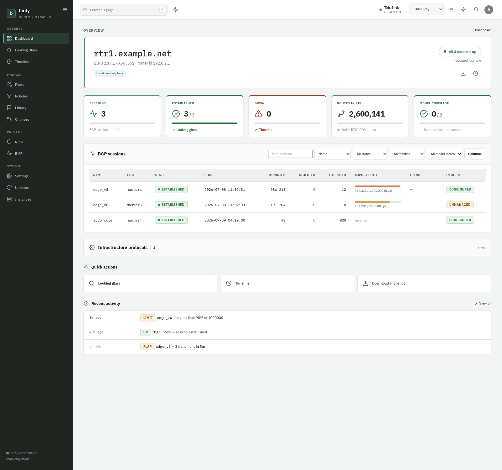
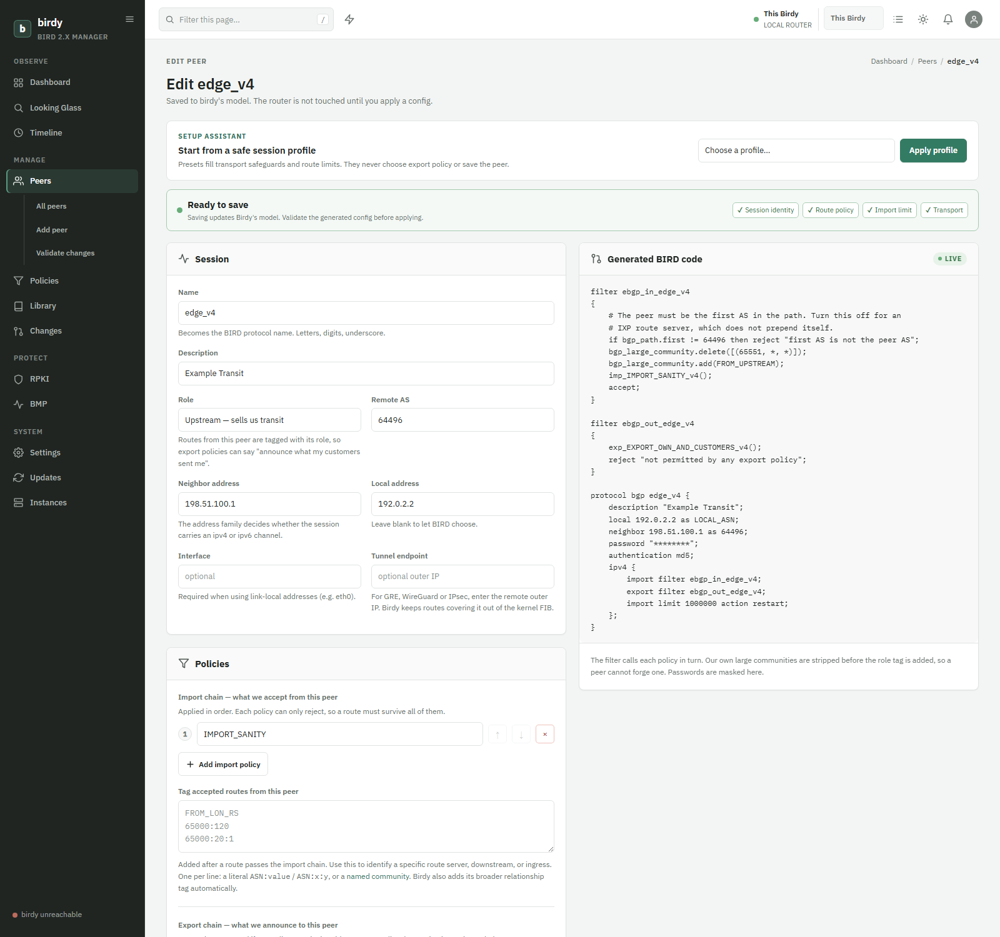
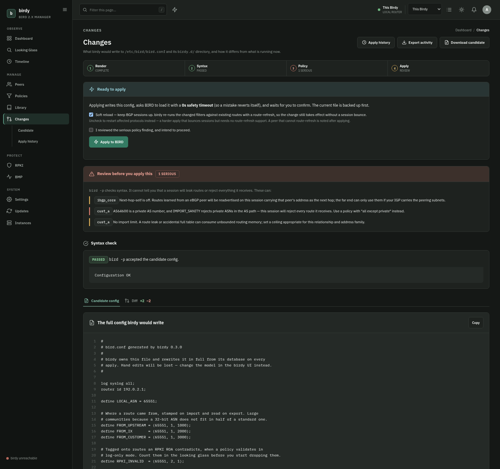
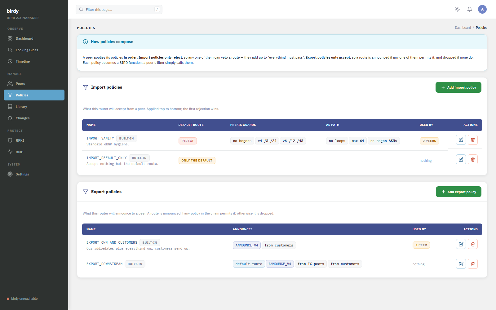

<div align="center">

# birdy

**A web UI for [BIRD 2.x](https://bird.network.cz/) that runs _on_ your router.**

eBGP/iBGP sessions, import/export policy, RPKI, RTBH, BFD — modelled in a database,
rendered to `bird.conf`, and applied with an armed auto-revert. Plus live visibility
into what every session is actually doing.

_No agents. No controller. No fleet. One router, done well._

[](https://github.com/floreabogdan/birdy/actions/workflows/ci.yml)
[](https://github.com/floreabogdan/birdy/releases)
[](go.mod)
[](LICENSE)
[](https://buymeacoffee.com/floreabogdan)

<br>



</div>

---

## What it is

birdy is a single Go binary you run on a BIRD router, under systemd or in a container.
It gives you:

- a **live dashboard** of every BGP session, read straight from BIRD's control socket, and
- a **model** of the config — peers, policies, prefix/AS sets — that it renders into the
  whole `bird.conf` and can apply for you, safely, with a one-command rollback.

**It works the moment you install it.** No flags to discover, no unit to edit: birdy detects what
the router can do — `bgpq4` for IRR expansion, `ping`/`traceroute` for diagnostics — and enables it.
Writing `bird.conf` is still a deliberate act you take in the UI, not something it does on install.

<table>
<tr>
<td width="50%"><br><sub><b>Edit a peer, watch the generated BIRD code update as you type.</b></sub></td>
<td width="50%"><br><sub><b>Syntax-check, lint, diff, then apply with an armed auto-revert.</b></sub></td>
</tr>
<tr>
<td width="50%"><br><sub><b>Composable policy chains — import rejects, export accepts.</b></sub></td>
<td width="50%" valign="top"><br>

**Model**
- Peers with roles (upstream, IX, customer, iBGP) that drive origin tagging
- Composable import/export policy chains, RPKI ROV, RTBH, BFD
- Prefix sets, AS sets, static routes — expandable from IRR with `bgpq4`

**Observe**
- Live sessions, per-peer detail, on-demand looking glass
- Timeline of flaps and limit hits
- Alerts to Slack, Discord, email, or a webhook

</td>
</tr>
</table>

## Read this before you install it

> [!WARNING]
> **birdy is beta software. Expect bugs.** It is a personal project released in the hope it is
> useful to someone else. Nothing here has been through the kind of testing a piece of routing
> infrastructure deserves.

> [!CAUTION]
> **Do not point birdy at a router with a configuration you care about.** birdy does not import,
> merge with, or preserve an existing `bird.conf`. It renders the _entire_ config file from its own
> database. Anything it does not know about — a protocol, a filter, a table, a hand-tuned option —
> does not exist as far as birdy is concerned, and would be gone from any config it wrote. Use it on
> a **new router**, or on one whose config you are content to re-create inside birdy from scratch.

**birdy is opinionated.** It does not expose every knob BIRD has. It renders what its authors believe
is good practice — RFC 8212 default-deny on export, bogon prefix and ASN filtering, large communities
to tag route origin, enforce-first-AS on eBGP, next-hop-self on iBGP, RPKI invalid drop — and it will
happily refuse to render a config it thinks is a route leak. Anything it does not model goes in a raw
block, appended verbatim. If you disagree with those opinions, birdy is the wrong tool and you should
write `bird.conf` by hand. That is a perfectly good way to run a router.

**There is no support.** No warranty, no SLA, no guarantee of fitness for anything. Issues and pull
requests are welcome and may be ignored. If you run this and it breaks your BGP session, your transit,
your customers, or your night's sleep, that is entirely your responsibility. You accepted that the
moment you ran it. See [LICENSE](LICENSE).

## Install

> 📖 **Full guide:** [`docs/USAGE.md`](docs/USAGE.md) walks through installing every
> dependency, each command-line flag, and what every peer and policy knob does.

birdy runs on the router, next to BIRD. Pick one of these.

<details open>
<summary><b>Download a binary</b></summary>

Grab the archive for your platform from the [latest release](https://github.com/floreabogdan/birdy/releases/latest)
(linux amd64/arm64/arm, freebsd, macOS), verify it, and drop the binary on the router:

```sh
tar -xzf birdy_*_linux_amd64.tar.gz
sudo install birdy /usr/local/bin/birdy
```
</details>

<details>
<summary><b>Linux package (.deb / .rpm / .apk)</b></summary>

Each release ships packages for amd64, arm64 and armhf. They install the binary to
`/usr/bin/birdy`, a systemd unit, and create a `birdy` system user in the `bird` group:

```sh
# Debian / Ubuntu
sudo apt install ./birdy_*_amd64.deb
# RHEL / Fedora
sudo dnf install ./birdy-*.x86_64.rpm
```

The package does **not** start birdy — set it up first, as the post-install message explains:

```sh
sudo birdy init --db /var/lib/birdy/birdy.db --asn 64496 --router-id 192.0.2.1
sudo systemctl enable --now birdy
```

It recommends `bird2` but does not force it. `apt purge` removes the database (which holds
BGP passwords); a plain `apt remove` keeps it. (The `.apk` is provided for convenience; Alpine
uses OpenRC, so you supply your own service under it.)
</details>

<details>
<summary><b>go install</b></summary>

Requires Go 1.25+. The binary is static (`CGO_ENABLED=0`); SQLite is
[modernc.org/sqlite](https://modernc.org/sqlite), so there is nothing to link against.

```sh
go install github.com/floreabogdan/birdy/cmd/birdy@latest
```

Or cross-compile from anywhere and copy one file to the router:

```sh
CGO_ENABLED=0 GOOS=linux GOARCH=amd64 go build -trimpath -ldflags="-s -w" -o birdy ./cmd/birdy
scp birdy root@router:/usr/local/bin/birdy
```
</details>

<details>
<summary><b>Docker</b></summary>

Run it on the same host as BIRD, sharing BIRD's control socket into the container. A prebuilt
multi-arch image is published to the GitHub Container Registry:

```sh
# one-time: create the database and admin account
docker run --rm -it -v birdy-data:/var/lib/birdy \
  ghcr.io/floreabogdan/birdy:latest \
  init --asn 64496 --router-id 192.0.2.1 --label rtr1

# run the viewer, reachable only on the host's loopback
docker run -d --name birdy --restart unless-stopped \
  -p 127.0.0.1:8080:8080 \
  -v birdy-data:/var/lib/birdy \
  -v /run/bird:/run/bird:ro \
  ghcr.io/floreabogdan/birdy:latest
```

The image bundles the `bird` binary so `bird -p` syntax checks work inside the container. See
[`docker-compose.yml`](docker-compose.yml) for a Compose setup and the notes on enabling apply.
</details>

Then, on the router:

```sh
birdy doctor                       # preflight: can it reach BIRD? can it write what it needs?
birdy init --asn 64496 --router-id 192.0.2.1 --label rtr1
sudo systemctl enable --now birdy  # the package installs the unit; no flags to add
```

`birdy init` prompts for an admin password. It reads BIRD's control socket (`/run/bird/bird.ctl` by
default), so it needs to run as a user in BIRD's group — the packaged unit
([`deploy/birdy.service`](deploy/birdy.service)) runs it as an unprivileged `birdy` user in group
`bird`, with `ProtectSystem=strict`. Run `init` under `sudo` if you like: it hands the database it
creates to that account, so the service can write its own state.

birdy then **listens on port 8080 on every interface**, and enables whatever the router can do. Two
things follow from that, and both are one setting away:

- **Set the access list.** Settings → Access control takes the IPs allowed to reach birdy at all;
  anything else has its connection closed with no response. Until you do, birdy accepts connections
  from anywhere and says so on the dashboard. **There is no TLS** — on a public address the login
  crosses the network in the clear, so either restrict it to a management range you trust, or run it
  closed with `birdy server --listen 127.0.0.1:8080` and an SSH tunnel.
- **Run it as a viewer, if you prefer.** Add `--read-only` to the unit and birdy never writes
  `bird.conf` or issues a write command to BIRD. Out of the box it *can* write — but only when you
  press Adopt and then Apply, both deliberate acts with a diff, a backup and an armed auto-revert.

## What works today

**Observe**
- Live dashboard of every BIRD protocol, split into BGP sessions and infrastructure
- Per-peer detail: BGP state, channels, import limits, and the raw control-socket output
- Route browser per session — imports, exports, and what was rejected on export
- On-demand looking glass (`show route for …`)
- Ping and traceroute from the router itself (on when those tools are installed) — a reachability
  looking glass to go alongside the route one
- Timeline of session transitions, flaps, and prefix-limit hits — interleaved with an audit trail of
  operator actions: who changed which peer or policy, and every config apply or revert
- Alerts to any number of destinations — Slack, Discord, email (SMTP), or a generic JSON webhook —
  when a session drops, recovers, flaps, hits its limit, or a config is applied/reverted; with
  per-destination event filtering and repeat-suppression
- An alert when BIRD itself becomes unreachable — the one failure session alerts can't catch
- A config-drift alert when `bird.conf` changes outside birdy — a hand edit, a `birdc` reconfigure, or a
  revert birdy did not perform
- Route-count history charts, on the dashboard grid and per peer, from samples birdy records itself —
  no Prometheus or Grafana needed to see when a session started leaking. Hover one and it names the
  point under the cursor: how many routes, and when
- A Prometheus `/metrics` endpoint (on once the access list is narrowed) and a public `/healthz` probe
- Login rate-limiting (per-IP lockout) and a downloadable off-box backup bundle
- Live BIRD-code preview on every editor: the generated config updates as you type, before you save
- Every table paginated with numbered pages — the route browsers, the timeline, the apply history, and
  each library list

**Model**
- Peers with roles (upstream, IX peer, customer, iBGP), which drive automatic origin tagging
- Disable a session from the peers list: it renders BIRD's `disabled`, so BIRD stops connecting
  entirely — and birdy reads that back as *disabled*, not as a session that failed
- iBGP with next-hop-self and route reflection; AS-path prepending, export communities, one-click
  drain (RFC 8326 graceful shutdown), and BFD per peer
- Composable import and export policy chains that can match communities, rather than one policy per
  session; clone a peer to make another of the same shape
- A library of prefix sets, AS sets, and static routes — both set kinds can be expanded from an IRR
  AS-SET with `bgpq4` (used automatically when installed), and kept current on a schedule (never
  auto-applied)
- Seed peers from the running BIRD — scaffold the model from the sessions BIRD already runs, so adopting
  a router is a review-and-import rather than re-typing every session by hand
- RFC 7999 customer blackhole (RTBH); PeeringDB lookups on the peer form
- BMP monitoring stations (RFC 7854) — stream every session's pre- and post-policy RIB to a collector
- Bogon prefixes and bogon ASNs, editable, in Settings
- RPKI: RTR servers and per-policy validation (log-only or drop-invalid). The dry run says how many
  routes BIRD is tagging invalid right now — **the number you would drop by enforcing** — and lists
  them; a table shows every import policy, whether it validates, and which peers ride on it
- A raw config block for everything birdy does not model, checked by `bird -p` before it saves

**Preview and apply**
- The whole candidate `bird.conf`, rendered from the model, with a syntax check via `bird -p`
- A unified diff against the running config
- A linter for what `bird -p` cannot catch: route leaks, sessions that would accept nothing,
  unreachable filter branches, an RTR server nobody validates against
- **Apply** (when not read-only): back up the current file, write the new one, `configure check` on
  the daemon, then `configure [soft] timeout` — BIRD holds the new config with an armed auto-revert.
  Confirm within the window to keep it; do nothing and BIRD reverts on its own. Soft reload re-runs
  filters without bouncing sessions.
- **The authorship guard**: birdy stores a hash of what it wrote and refuses to overwrite a
  `bird.conf` it did not author. A hand-managed file must be explicitly adopted (which backs it up).
- **Apply history**: every applied config is kept — browse it, diff any version against what is
  running, and re-apply an old one (the emergency-rollback path). `birdy doctor` checks readiness.

For apply to work, birdy needs write access to `bird.conf` and its directory, and `--bird-conf` must
be the same path BIRD was started with (`bird -c`). Passwords go to disk (BIRD needs them) but are
still masked everywhere in the browser.

## Security

**birdy listens on every interface, and has no TLS.** It ships that way on purpose — a router UI that
needs a config file edited before it answers is a UI nobody sets up — but it means the first thing to
do after logging in is narrow who can reach it.

The **IP allow-list** (Settings → Access control) is that control: every request from an address you
did not list has its connection closed with no response at all. Loopback is always allowed, so an SSH
tunnel can never lock you out. While the list still allows everything, birdy says so once in its
startup log and flags it on that settings page. The unauthenticated `/metrics` endpoint is gated on it
too — no cookie can protect a Prometheus scrape, so
it stays closed until the list is narrowed, and starts serving the moment it is.

That is not TLS. On a public address the login and session cookie cross the network in the clear, and
an allow-list does nothing about interception — only about who may connect. If the router is on the
public internet, restrict it to a management range you control, or run it closed:

```sh
birdy server --listen 127.0.0.1:8080     # then: ssh -L 8080:127.0.0.1:8080 router
```

An **audit log** on the timeline records every operator action, attributed to the user who made it.

BGP MD5 session passwords are stored **in the clear** in birdy's SQLite database, because that is the
form BIRD needs them in. The database file is therefore as sensitive as `bird.conf` itself. Passwords
are never rendered into the browser: the peer form shows a blank field meaning "unchanged", and both
sides of the config diff are masked.

If you want a pure viewer, add `--read-only` to the unit: birdy then never writes `bird.conf` and never
issues a write command to BIRD.

## Development

```sh
go test ./...
```

All addresses and AS numbers in the test fixtures — and in the screenshots above — are from the
documentation ranges of [RFC 5398](https://www.rfc-editor.org/rfc/rfc5398),
[RFC 5737](https://www.rfc-editor.org/rfc/rfc5737) and [RFC 3849](https://www.rfc-editor.org/rfc/rfc3849).

The UI is server-rendered `html/template` with `go:embed` and a little vanilla JavaScript. There is
no node build step and there will not be one. [`PLAN.md`](PLAN.md) is the original design document —
the reasoning behind the data model and the milestone thinking — kept as a record; the product has
since moved past it, so read it as design intent, not current truth.

## Contributors

Built and maintained by **Bogdan — [AS210622](https://bgp.tools/as/210622)**.

- **Aaran — [AS204208](https://bgp.tools/as/204208) / [AS47272](https://bgp.tools/as/47272)** — kernel export hardening, import community tagging, native HTTPS, HTTP/session security, dashboard model coverage.

Contributions are welcome — open an issue or a pull request.

## License

[BSD Zero Clause](LICENSE) — public-domain-equivalent. Do whatever you like with it; you owe no
attribution and get no warranty.

The bundled webfonts are [IBM Plex](https://github.com/IBM/plex), copyright IBM Corp., used under the
SIL Open Font License 1.1 — see [`internal/web/static/fonts/LICENSE.txt`](internal/web/static/fonts/LICENSE.txt).
That license covers the fonts only, not birdy.
